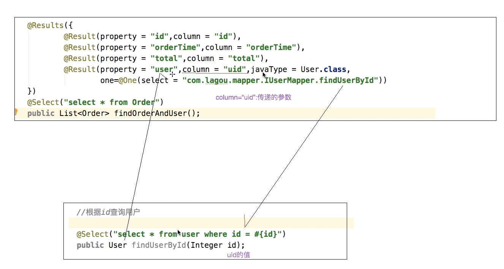
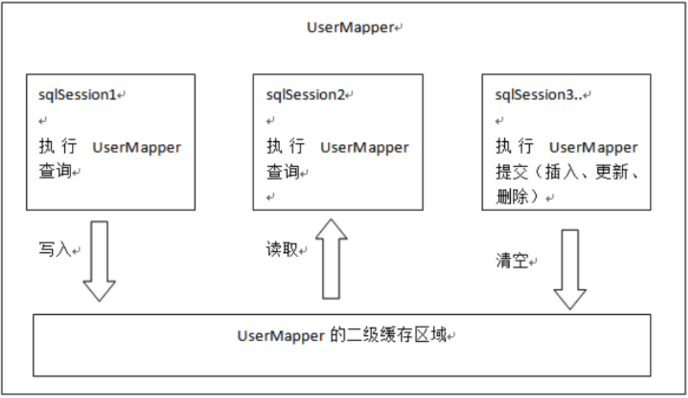
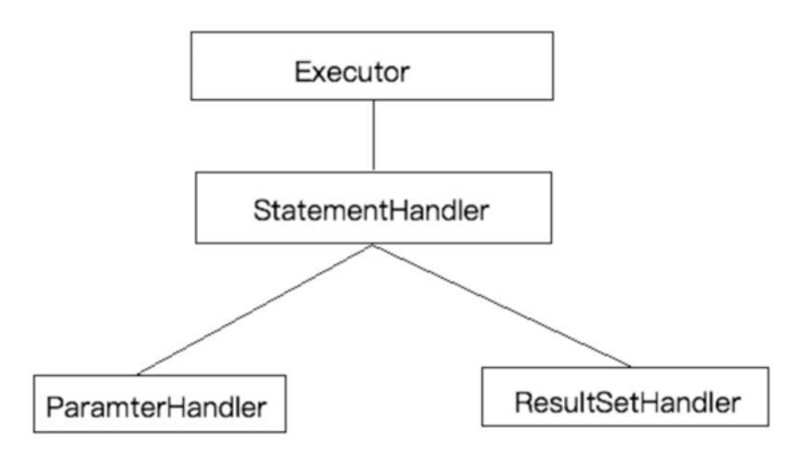
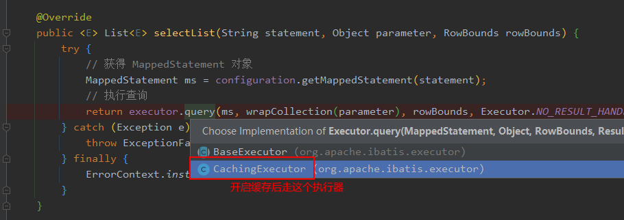

# Mybatis相关概念

## 1. 对象/关系数据库映射（ORM）

ORM全称Object/Relation Mapping：表示对象-关系映射的缩写 

ORM把关系数据库包装成面向对象的模型。ORM框架是面向对象设计语言与关系数据库发展不同步时的中间解决方案。 

## 2. Mybatis简介

MyBatis是一款优秀的基于ORM的半自动轻量级持久层框架，它支持定制化SQL、存储过程以及高级映射。MyBatis免了几乎所有的JDBC代码和手动设置参数以及获取结果集。MyBatis可以使用简单的XML或注解来配置和映射原生类型、接口和Java的POJO （Plain Old Java Objects,普通老式Java对 象）为数据库中的记录。 

## 3. Mybatis优势

Mybatis是一个半自动化的持久层框架，对开发人员开说，核心sql还是需要自己进行优化，sql和java编码进行分离，功能边界清晰，一个专注业务，一个专注数据。 

# Mybatis基本应用

## 1. 步骤

①添加MyBatis的依赖包

②创建user数据表

③编写User实体类

④编写核心文件SqlMapConfig.xml

⑤编写映射文件UserMapper.xml

⑥编写测试类 

## 2. 代码编写与解析

- 源码[链接  点击跳转](../mybatis_quickStarter)

- 配置文件：

    `sqlMapConfig.xml`文件需要的文件头：

    ```xml
    <?xml version="1.0" encoding="UTF-8" ?>
    <!DOCTYPE configuration PUBLIC "-//mybatis.org//DTD Config 3.0//EN"
            "http://mybatis.org/dtd/mybatis-3-config.dtd">
    ```

    `UserMapper.xml`需要的头：

    ```xml
    <?xml version="1.0" encoding="UTF-8" ?>
    <!DOCTYPE mapper
            PUBLIC "-//mybatis.org//DTD Mapper 3.0//EN"
            "http://mybatis.org/dtd/mybatis-3-mapper.dtd">
    ```

- 传统开发方式

  ```java
      @Test
      public void test1() throws IOException {
          // 1.Resources工具类，配置文件的加载，把配置文件加载成字节输入流
          InputStream resourceAsStream = Resources.getResourceAsStream("sqlMapConfig.xml");
          //2.解析了配置文件，并创建了sqlSessionFactory工厂
          SqlSessionFactory sessionFactory = new SqlSessionFactoryBuilder().build(resourceAsStream);
  
          //3.生产sqlSession
          // 默认开启一个事务，但是该事务不会自动提交
          //在进行增删改操作时，要手动提交事务
          SqlSession sqlSession = sessionFactory.openSession();
  
          // 4.sqlSession调用方法：查询所有selectList 查询单个：selectOne 添加：insert  修改：update 删除：delete
          List<User> users = sqlSession.selectList("com.xiewz.dao.IUserDao.findAll");
  
          for (User user : users) {
              System.out.println(user);
          }
  
          // 5. 释放资源
          sqlSession.close();
      }
  
      @Test
      public void test2() throws IOException {
          InputStream resourceAsStream = Resources.getResourceAsStream("sqlMapConfig.xml");
          SqlSessionFactory sqlSessionFactory = new SqlSessionFactoryBuilder().build(resourceAsStream);
          SqlSession sqlSession = sqlSessionFactory.openSession();
  
          User user = new User();
          user.setId(4);
          user.setUsername("lucy");
          sqlSession.update("com.xiewz.dao.IUserDao.updateUser",user);
          // 增删改操作需要手动commit
          sqlSession.commit();
  
          sqlSession.close();
      }
  ```

  每次执行数据库操作都是由sqlSession开启调用。

  **注意点：**

  1. SqlSession执行完后记得释放资源

  2. sessionFactory.openSession()获取的SqlSession不会自动提交事务，每次执行完增、删、改操作都需要手动commit

- 代理开发方式

  mybatis使用代理模式来实现Dao层。

  Mapper 接口开发需要遵循以下规范 

  **1 Mapper.xml文件中的namespace与mapper接口的全限定名相同** 

  **2 Mapper接口方法名和Mapper.xml中定义的每个statement的id相同** 

  **3 Mapper接口方法的输入参数类型和mapper.xml中定义的每个sql的parameterType的类型相同** 

  **4 Mapper接口方法的输出参数类型和mapper.xml中定义的每个sql的resultType的类型相同** 

  

  编写UserMapper接口

  ```java
  @Test
      public void test3() throws IOException {
          // 1.Resources工具类，配置文件的加载，把配置文件加载成字节输入流
          InputStream resourceAsStream = Resources.getResourceAsStream("sqlMapConfig.xml");
          //2.解析了配置文件，并创建了sqlSessionFactory工厂
          SqlSessionFactory sessionFactory = new SqlSessionFactoryBuilder().build(resourceAsStream);
          //3.生产sqlSession
          SqlSession sqlSession = sessionFactory.openSession();
  
          int[] ids = {1,2};
          // 获取动态代理对象 代理实现了IUserDao接口
          IUserDao mapper = sqlSession.getMapper(IUserDao.class);
          List<User> userList = mapper.findByIds(ids);
  
          for (User user : userList) {
              System.out.println(user);
          }
  
          // 5. 释放资源
          sqlSession.close();
      }
  ```

  其中`IUserDao mapper = sqlSession.getMapper(IUserDao.class);`就获取了代理实现


# Mybatis配置文件

## 1. 核心配置文件SqlMapConfig.xml 

- configuration  配置
  - properties  属性
  - setting 设置
  - typeAliases 别名
  - typeHandlers 类型处理器
  - objectFactory 对象工程
  - plugins 插件
  - environments 
    - environment 环境变量
      - transactionManager 事务管理器
      - dataSource 数据源
  - databaseIdProvider 数据库厂商标识
  - mappers 映射器

## 2. MyBatis常用配置解析 

### environments标签 

数据库环境的配置，支持多环境配置 

其中，事务管理器（transactionManager）类型有两种：
•JDBC：这个配置就是直接使用了JDBC 的提交和回滚设置，它依赖于从数据源得到的连接来管理事务作用域。
•MANAGED：这个配置几乎没做什么。它从来不提交或回滚一个连接，而是让容器来管理事务的整个生命周期（如 JEE 应用服务器的上下文）。 默认情况下它会关闭连接，然而一些容器并不希望这样，因此需要将closeConnection 属性设置为 false 来阻止它默认的关闭行为。其中，数据源（dataSource）类型有三种：
•UNPOOLED：这个数据源的实现只是每次被请求时打开和关闭连接。
•POOLED：这种数据源的实现利用“池”的概念将 JDBC 连接对象组织起来。 
•JNDI：这个数据源的实现是为了能在如 EJB 或应用服务器这类容器中使用，容器可以集中或在外部配置数据源，然后放置一个 JNDI 上下文的引用。 

## 3. 映射配置文件mapper.xml 


**todo**

# Mybatis复杂映射开发

## 1. 一对一查询

一对一查询，也就是两张表的数据连接成一个结果，如下面查询语句的结果

```sql
select * from orders o,user u where o.id=u.id
```

此时查出了用户信息与订单信息

代码准备：

1. 创建配置文件 `IUserMapper.xml`、`jdbc.properties`、`sqlMapConfig.xml`
2. 创建实体类，User和Order
3. 创建IUserMapper

注意：

1. 可以在Order实体中新增User属性

   ```java
   public class Order {
   
       private Integer id;
       private String orderTime;
       private Double total;
   
       // 表明该订单属于哪个用户
       private User user;
   }
   ```

2. `Mapper.xml`文件中，两个表的id同名，会有问题

   所以需要定义`resultMap`的时候需要定义`association`

   ```xml
   <resultMap id="orderMap" type="com.xiewz.pojo.Order">
           <result property="id" column="id"></result>
           <result property="orderTime" column="orderTime"></result>
           <result property="total" column="total"></result>
           <association property="user" javaType="com.xiewz.pojo.User">
               <result property="id" column="uid"></result>
               <result property="username" column="username"></result>
           </association>
       </resultMap>
   ```

   

## 2. 一对多查询

一个用户对应多个订单时，属于一对多查询，查询出user，同时查询出订单list

注意在resultMap中定义Order集合`collection`如下：

```xml
<resultMap id="userMap" type="com.xiewz.pojo.User">
        <result property="id" column="id"></result>
        <result property="username" column="username"></result>
        <collection property="orderList" ofType="com.xiewz.pojo.Order">
            <result property="id" column="oid"></result>
            <result property="orderTime" column="ordertime"></result>
            <result property="total" column="total"></result>
        </collection>
    </resultMap>
```


## 3. 多对多查询

一个用户对应多个角色，同时一个角色可以对于多个用户，属于多对多查询，resultMap定义

```xml
   <resultMap id="userRoleMap" type="com.xiewz.pojo.User">
        <result property="id" column="userid"></result>
        <result property="username" column="username"></result>
        <collection property="roles" ofType="com.xiewz.pojo.Role">
            <result property="id" column="roleid"></result>
            <result property="roleName" column="roleName"></result>
            <result property="roleDesc" column="roleDesc"></result>
        </collection>
    </resultMap>
```


# Mybatis注解开发

## 增删查改

```java
public interface IUserMapper {
    // 添加用户
    @Insert("insert into user values(#{id},#{username})")
    void addUser(User user);

    //更新用户
    @Update("update user set username = #{username} where id = #{id}")
    public void updateUser(User user);

    //查询用户
    @Select("select * from user")
    public List<User> selectUser();

    //删除用户
    @Delete("delete from user where id = #{id}")
    public void deleteUser(Integer id);
}
```


## 1. 一对一查询

**@One 代替`association**`

接口注解改为一下例子：

1 修改`IOrderMapper.java`增加注解，并指向User查询

```java
@Results({
            @Result(property = "id",column = "id"),
            @Result(property = "orderTime",column = "orderTime"),
            @Result(property = "total",column = "total"),
            @Result(property = "user",column = "uid",javaType = User.class,
                    one=@One(select = "com.xiewz.mapper.IUserMapper.findUserById"))
    })
@Select("select * from orders")
public List<Order> findOrderAndUser();
```

2 修改`IUserMapper.java`增加方法

```java
@Select({"select * from user where id = #{id}"})
public User findUserById(Integer id);
```

3 此时，调用findOrderAndUser()方法时，同时会通过`uid` 关联查询User信息



## 2. 一对多查询

**@Many 代替`collection**`

`IUserMapper.java`查询用户订单

```xml
@Select("select * from user")
    @Results({
            @Result(property = "id",column = "id"),
            @Result(property = "username",column = "username"),
            @Result(property = "orderList", column = "id",javaType = List.class,many = @Many(select = "com.xiewz.mapper.IOrderMapper.findOrderByUid")),
    })
    public List<User> findAll();
```


## 3. 多对多查询

`IUserMapper.java` 查询用户角色

```java
@Select("select * from user")
        @Results({
                @Result(property = "id",column = "id"),
                @Result(property = "username",column = "username"),
                @Result(property = "roleList" ,column = "id" ,javaType = List.class ,many = @Many(select = "com.xiewz.mapper.IOrderMapper.findOrderByUid"))
        })
// 多对多
// 查询用户与角色信息
List<User> findAllUserAndRole();
```


# Mybatis缓存

**一级缓存在SQLSession的HashMap中，二级缓存在Mapper的namespace中**

## 一级缓存

一级缓存位于sqlSession的HashMap，key值为`statementid、params、boundSql、rowBounds`，value值为结果对象

```java
    @Test
    public void firstLevelCache(){
        // 第一次查询id为1的用户
        User user1 = userMapper.findUserById(1);

        //当手动提交事务，或者手动刷新时，会刷新一级缓存 
        // sqlSession.commit();  
        // sqlSession.clearCache();
        // 执行增删改操作，也会刷新一级缓存

        // 第二次查询id为1的用户
        User user2 = userMapper.findUserById(1);

        System.out.println(user1==user2);
    }
```


Mybatis第一次查询的时候，首先去一级缓存中查询，有就直接返回，没有就查数据库并把数据存储到一级缓存中。

所以，当第二次查询的时候，如果有缓存则不会去查询数据库了

**分析源码**

一级缓存对应方法实现：

跟踪源码找到Executor接口，包含了创建缓存与清除缓存的方法：

```java
 public interface Executor {
    CacheKey createCacheKey(MappedStatement var1, Object var2, RowBounds var3, BoundSql var4);
     void clearLocalCache();
 }
```

实现类`BaseExecutor.java`因为所有的查询最终都会走它的query()方法：

```java
    public <E> List<E> query(MappedStatement ms, Object parameter, RowBounds rowBounds, ResultHandler resultHandler) throws SQLException {
        BoundSql boundSql = ms.getBoundSql(parameter);
        // 在这里调用了创建cacheKey的方法，之后再去执行具体查询操作
        CacheKey key = this.createCacheKey(ms, parameter, rowBounds, boundSql);
        return this.query(ms, parameter, rowBounds, resultHandler, key, boundSql);
    }


/**具体查询方法*/
public <E> List<E> query(...) throws SQLException {
    // 省略...
    
    // mybatis先从localCache中查询缓存数据，如果有，则不再查询数据库
    list = resultHandler == null ? (List)this.localCache.getObject(key) : null;
                if (list != null) {
                    this.handleLocallyCachedOutputParameters(ms, key, parameter, boundSql);
                } else {
                    list = this.queryFromDatabase(ms, parameter, rowBounds, resultHandler, key, boundSql);
                }
    // ......
}

/**第一次查询走这里*/
private <E> List<E> queryFromDatabase(...){
    this.localCache.putObject(key, ExecutionPlaceholder.EXECUTION_PLACEHOLDER);

    List list;
    try {
        list = this.doQuery(ms, parameter, rowBounds, resultHandler, boundSql);
    } finally {
        this.localCache.removeObject(key);
    }

    // 当没有缓存时会进这个方法，这里查询完后，会进行插入缓存操作
    this.localCache.putObject(key, list);
    if (ms.getStatementType() == StatementType.CALLABLE) {
        this.localOutputParameterCache.putObject(key, parameter);
    }

    return list;
}

```

**mybatis默认开启了以及缓存**


## 二级缓存

开启方法：

1 全局配置 

```xml
<!--开启二级缓存  -->
<settings>
    <setting name="cacheEnabled" value="true"/>
</settings>
```

2 如果使用xml方式开发，就在UserMapper.xml文件中开启缓存 `<cache></cache>` 

  如果是注解方式，则在`IUserMapper.java`中增加注解 `@CacheNamespace`

3 在 具体CURD标签上配置  **useCache=true** 

二级缓存的数据读取方式：



**二级缓存的对象需要实现Serializable**

**二级缓存的是数据，不是对象**

## redis分布式缓存

添加依赖：

```xml
<dependency>
    <groupId>org.apache.commons</groupId>
    <artifactId>commons-pool2</artifactId>
    <version>2.4.3</version>
</dependency>
<dependency>
    <groupId>org.mybatis.caches</groupId>
    <artifactId>mybatis-redis</artifactId>
    <version>1.0.0-beta2</version>
</dependency>
```

添加注解:

```java
@CacheNamespace(implementation = RedisCache.class)//开启二级缓存
public interface IUserMapper {
}
```


# MyBatis插件

## 介绍

Mybati s作为一个应用广泛的优秀的ORM开源框架，这个框架具有强大的灵活性，在四大组件(Executor、StatementHandler、ParameterHandler、ResultSetHandler)处提供了简单易用的插 件扩机制。Mybatis对持久层的操作就是借助于四大核心对象。MyBatis支持用插件对四大核心对象进 行拦截，对mybatis来说插件就是拦截器，用来增强核心对象的功能，增强功能本质上是借助于底层的 动态代理实现的，换句话说，MyBatis中的四大对象都是代理对象 



**MyBatis所允许拦截的方法如下：**

- 执行器Executor (update、query、commit、rollback等方法)；
- SQL语法构建器StatementHandler (prepare、parameterize、batch、updates query等方 法)；
- 参数处理器ParameterHandler (getParameterObject、setParameters方法)；
- 结果集处理器ResultSetHandler (handleResultSets、handleOutputParameters等方法)； 

## 自定义插件

**步骤：**

1. 定义插件拦截
2. 增加插件配置

**实现：**

1 插件定义代码：

```java
@Intercepts({
        // 拦截StatementHandler.prepare(Connection,Integer)
        @Signature(type = StatementHandler.class,method = "prepare",args = {Connection.class, Integer.class})
})
public class MyPlugin implements Interceptor {
    /**
     * 拦截方法： 只要被拦截的目标对象的目标方法被执行时，每次都会执行intercept方法
     * @param invocation
     * @return
     * @throws Throwable
     */
    @Override
    public Object intercept(Invocation invocation) throws Throwable {
        System.out.println("拦截了方法  增强。。。");
        // 原方法执行
        return invocation.proceed();
    }

    /**
     * 主要是为了吧当前的拦截器生成的代理存到拦截器链中
     * @param target
     * @return
     */
    @Override
    public Object plugin(Object target) {
        Object wrap = Plugin.wrap(target, this);
        return wrap;
    }

    @Override
    public void setProperties(Properties properties) {
        System.out.println("获取到的配置文件的参数是："+properties);
    }
}
```

2 `sqlMapConfig.xml`中的`plugins`标签中增加插件配置即可

```xml
<plugin interceptor="com.xiewz.plugin.MyPlugin">
    <property name="name" value="tom123"/>
</plugin>
```


3 源码插件调用逻辑

```java
@Override
public Object invoke(Object proxy, Method method, Object[] args) throws Throwable {
  try {
      /*
        *获取被拦截方法列表，比如：
        * signatureMap.get(Executor.class), 可能返回 [query, update, commit]
        */
    Set<Method> methods = signatureMap.get(method.getDeclaringClass());
      //检测方法列表是否包含被拦截的方法
    if (methods != null && methods.contains(method)) {
        //执行插件逻辑
      return interceptor.intercept(new Invocation(target, method, args));
    }
      //执行被拦截的方法
    return method.invoke(target, args);
  } catch (Exception e) {
    throw ExceptionUtil.unwrapThrowable(e);
  }
}
```


# mybatis源码解析

## mybatis层次结构

SQLSession-->Execute-->StatementHandler



## 二级缓存源码剖析

**当两个缓存同时开启时，mybatis会优先查找二级缓存**

二级缓存------》 一级缓存------》数据库 

与一级缓存不同，二级缓存和具体的命名空间绑定，一个Mapper中有一个Cache，相同Mapper中的MappedStatement共用一个Cache，一级缓存则是和 SqlSession 绑定。 


三个问题

1. 怎么解析标签<cache></cache> ，怎么产生cache对象

   ```
   MapperBuilderAssistant.addMappedStatement()方法中看二级缓存的设置值
   ```

2. 证实缓存流程

   CachingExecutor.java`

   为了**防止读取脏数据**，所以使用事务缓存来存储

   `TransactionalCache.java`

   ```
       @Override
       public Object getObject(Object key) {
           // issue #116
           // 从 delegate 中获取 key 对应的 value
           Object object = delegate.getObject(key);
           // 如果不存在，则添加到 entriesMissedInCache 中
           if (object == null) {
               entriesMissedInCache.add(key);
           }
           // issue #146
           // 如果 clearOnCommit 为 true ，表示处于持续清空状态，则返回 null
           if (clearOnCommit) {
               return null;
           // 返回 value
           } else {
               return object;
           }
       }
       
       @Override
       public void putObject(Object key, Object object) {
           // 暂存 KV 到 entriesToAddOnCommit 中
           entriesToAddOnCommit.put(key, object);
       }
       
       public void commit() {
           // 如果 clearOnCommit 为 true ，则清空 delegate 缓存
           if (clearOnCommit) {
               delegate.clear();
           }
           // 将 entriesToAddOnCommit、entriesMissedInCache 刷入 delegate 中
           flushPendingEntries();
           // 重置
           reset();
       }
   ```

3. 为什么mapper1需要执行**commit**或者**close**才能让mapper2命中二级缓存

   因为在get时，是从委托缓存对象中去取。只有在commit方法才会将 entriesToAddOnCommit、entriesMissedInCache 刷入 delegate 中


**同一个mapper.xml文件使用同一个二级缓存cache**

二级缓存只适用于不常用于增、删、改操作的数据。一旦数据变更，mybatis会清空缓存


## 总结

在二级缓存的设计上，MyBatis大量地运用了装饰者模式，如CachingExecutor, 以及各种Cache接口的装饰器。

- 二级缓存实现了Sqlsession之间的缓存数据共享，属于namespace级别
- 二级缓存具有丰富的缓存策略。
- 二级缓存可由多个装饰器，与基础缓存组合而成
- 二级缓存工作由 一个缓存装饰执行器CachingExecutor和 一个事务型预缓存TransactionalCache完成。 


# 延迟加载


```markdown
	延迟加载是基于嵌套查询来实现的 
```

1. 配置文件 `collection`标签加上`fetchType="lazy"`

   ```xml
       <resultMap id="userOrderMap" type="com.xiewz.pojo.User"  >
           <result property="id" column="userid"></result>
           <result property="username" column="username"></result>
           <collection property="orderList" ofType="com.xiewz.pojo.Order" select="com.xiewz.mapper.IOrderMapper.findByUid" column="id" fetchType="lazy">
               <result property="id" column="roleid"></result>
               <result property="orderTime" column="orderTime"></result>
               <result property="total" column="total"></result>
           </collection>
   
       </resultMap>
   
       <select id="lazyfindUserById" resultMap="userOrderMap"  useCache="true">
           select * from user where id = #{id}
       </select>
   ```

2. 全局延迟加载 在config.xml中增加

   ```xml
   <settings>
   <!--开启全局延迟加载功能-->
   <setting name="lazyLoadingEnabled" value="true"/>
   </settings>
   ```

3. 局部的延迟加载配置会优先于全职配置，也就是如果mapper内配置的单个语句不延迟加载，那么全局延迟加载就不会对它生效。

## 延迟加载原理实现 

它的原理是，使用 CGLIB 或 Javassist( 默认 ) 创建目标对象的代理对象。当调用代理对象的延迟加载属性的 getting 方法时，进入拦截器方法。比如调用 a.getB().getName() 方法，进入拦截器的invoke(...) 方法，发现 a.getB() 需要延迟加载时，那就会单独发送事先保存好的查询关联 B 对象的 SQL ，把 B 查询上来，然后调用 a.setB(b) 方法，于是 a 对象 b 属性就有值了，接着完成a.getB().getName() 方法的调用。这就是延迟加载的基本原理 

总结：延迟加载主要是通过动态代理的形式实现，通过代理拦截到指定方法，执行数据加载。 


# mybatis-plus使用

**传统的简单使用方法**

```markdown
1. UserMapper需要接口需要继承 BaseMapper
2. 使用mybatisplus 需要将SqlSessionFactoryBuilder替换为MybatisSqlSessionFactoryBuilder构造器
```


## AR模式

1. 实体类继承Model

2. mapper继承`BaseMapper<T>`

3. 最后可以直接使用对象调用curd操作

   ```java
   user.selectById()
   ```

   
## 性能分析插件

PerformanceInterceptor


## 乐观锁插件

   


