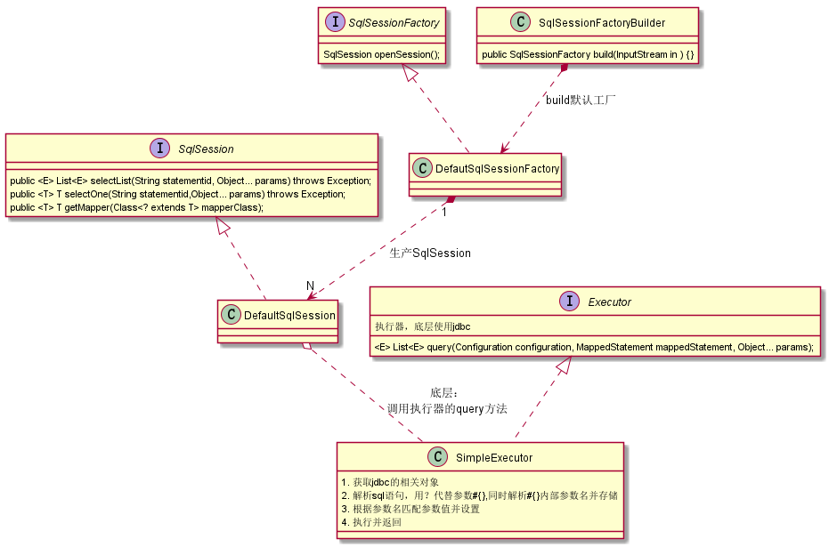

mysql 手写


## 分使用端与架构端

- 使用端

  创建配置文件，数据库连接配置、sqlmapper配置文件

  sql语句信息mapper

  

  sqlMapConfig.xml : 存放数据源信息，引入mapper.xml （存放）

  Mapper.xml : sql语句的配置文件信息 

  

- 架构端

  1.读取配置文件 

  读取完成以后以流的形式存在，我们不能将读取到的配置信息以流的形式存放在内存中，不好操作，可 以创建javaBean来存储 

  (1)Configuration : 存放数据库基本信息、Map<唯一标识，Mapper> 唯一标识:namespace + "." + id 

  (2)MappedStatement:sql语句、statement类型、输入参数java类型、输出 参数java类型 

   

  2.解析配置文件

  创建sqlSessionFactoryBuilder类:
   方法:sqlSessionFactory build(): 第一:使用dom4j解析配置文件，将解析出来的内容封装到Configuration和MappedStatement中 第二:创建SqlSessionFactory的实现类DefaultSqlSession 

  

  3.创建SqlSessionFactory:
   方法:openSession() : 获取sqlSession接口的实现类实例对象 

  

  4.创建sqlSession接口及实现类:主要封装crud方法 方法:selectList(String statementId,Object param):查询所有 selectOne(String statementId,Object param):查询单个 具体实现:封装JDBC完成对数据库表的查询操作 


## 代码步骤

框架层

1. 加载配置文件：根据配置文件路径，加载字节流到内存

2. 创建两个javaBean（容器对象） 存放的是对配置文件解析出来的内容

   Configuration：核心配置类，放sqlMapConfig.xml的内容

   MappedStatement 映射配置类 放mapper.xml内容

3. 解析配置文件：dom4j

   创建SqlSessionFactoryBuilder。方法：build(InputStream in)

   一 使用dom4j解析配置文件，装载到容器对象

   二 创建SqlSessionFactory对象；生成sqlSession （**工厂模式**）

4. DefaultSqlSessionFactory实现SqlSessionFactory

   生产sqlSession

5. 创建SqlSession接口及实现类 DefaultSession

   定义对数据库的curd操作：selectList() selectOne() update() delete()

6. 创建Executor接口及实现类SimpleExecutor实现类

   通用的query(Configuration ，MappedStatement，Object… param) 执行的就是JDBC操作代码


代码执行流程

1. 先加载配置文件

2. SqlSessionFactoryBuilder通过配置文件流构建SqlSessionFactory对象  得到工厂对象

3. 由工厂对象创建SqlSession

4. 最后由SqlSession提供增删查改方法语句

   还提供getMapper方法(**代理的dao层实现**)

5. sqlSession底层使用SimpleExecutor提供的query方法，其底层使用jdbc操作数据库


## 代码结构图



## 代码实现

1. `sqlSessionFactoryBuilder.java`主要用于创建SqlSessionFactory工厂，其中做了两件事：

   一 使用dom4j解析配置文件输入流并得到`Configuration`对象，

   二 通过配置对象创建默认工厂类实例`DefautSqlSessionFactory`用于生产`SqlSession`的

   ```java
   public class SqlSessionFactoryBuilder {
   
       public SqlSessionFactory build(InputStream in ) throws PropertyVetoException, DocumentException {
           // 第一：使用dom4j解析配置文件，将解析出来的内容封装到Configuration中
           XMLConfigBuilder xmlConfigBuilder = new XMLConfigBuilder();
           Configuration configuration = xmlConfigBuilder.parseConfig(in);
   
           // 第二：创建sqlSessionFactory对象：工厂类：生产sqlSession:会话对象
           SqlSessionFactory sqlSessionFactory = new DefautSqlSessionFactory(configuration);
           return sqlSessionFactory;
       }
   }
   ```

   `Configuration.java` 中主要存储xml解析出来的配置信息，包含数据库链接信息和sql语句信息

   ```java
   public class Configuration {
   
       // 数据库连接池
       DataSource dataSource;
   
       Map<String,MappedStatement> mappedStatementMap = new HashMap<String, MappedStatement>();
   
       public DataSource getDataSource() {
           return dataSource;
       }
   
       public void setDataSource(DataSource dataSource) {
           this.dataSource = dataSource;
       }
   
       public Map<String, MappedStatement> getMappedStatementMap() {
           return mappedStatementMap;
       }
   
       public void setMappedStatementMap(Map<String, MappedStatement> mappedStatementMap) {
           this.mappedStatementMap = mappedStatementMap;
       }
   }
   ```

2. 默认工厂类`DefautSqlSessionFactory.java` 提供一个**openSession()**方法，该方法用于获取SqlSession对象

   ```java
   public class DefautSqlSessionFactory implements SqlSessionFactory {
       private Configuration configuration ;
   
       public DefautSqlSessionFactory(Configuration configuration) {
           this.configuration = configuration;
       }
   
       @Override
       public SqlSession openSession() {
           SqlSession sqlSession = new DefaultSqlSession(configuration);
           return sqlSession;
       }
   }
   ```

3. 持久化核心实现类：`DefaultSqlSession.java`以上准备工作完成后，由session路由到指定sql语句并执行

   ```java
   public class DefaultSqlSession implements SqlSession {
   
       private Configuration configuration;
   
       public DefaultSqlSession(Configuration configuration) {
           this.configuration = configuration;
       }
   
       public <E> List<E> selectList(String statementid, Object... params) throws Exception {
           Executor executor = new SimpleExecutor();
           MappedStatement mappedStatement = configuration.getMappedStatementMap().get(statementid);
           List<Object> query = executor.query(configuration, mappedStatement, params);
   
           return (List<E>) query;
       }
   
       public <T> T selectOne(String statementid, Object... params) throws Exception {
           List<Object> objects = selectList(statementid, params);
           if (objects == null || objects.size() != 1) {
               throw new RuntimeException("查询结果为空或结果过多");
           }
           return (T) objects.get(0);
       }
   
   }
   ```

   

4. session通过执行器`Executor`来执行底层查询

   ```java
   public class SimpleExecutor implements Executor {
   
       /**
        * 使用jdbc进行数据库查询操作
        * 1. 获取jdbc的相关对象
        * 2. 解析sql语句，用？代替参数#{},同时解析#{}内部参数名并存储
        * 3. 根据参数名匹配参数值并设置
        * 4. 执行并返回
        * 
        * @param configuration 配置器
        * @param mappedStatement mapper配置，sql语句映射等
        * @param params 参数
        * @param <E>
        * @return
        * @throws Exception
        */
       public <E> List<E> query(Configuration configuration, MappedStatement mappedStatement, Object... params) throws Exception {
           // 底层执行器使用jdbc进行数据库查寻操作
           // 1. 注册驱动，获取连接
           Connection connection = configuration.getDataSource().getConnection();
   
           // 2. 获取sql语句 : select * from user where id = #{id} and username = #{username}
           //转换sql语句： select * from user where id = ? and username = ? ，转换的过程中，还需要对#{}里面的值进行解析存储
           String sql = mappedStatement.getSql();
           BoundSql boundSql = getBoundSql(sql);
   
           // 3.获取预处理对象：preparedStatement
           PreparedStatement preparedStatement = connection.prepareStatement(boundSql.getSqlText());
   
           // 4. 设置参数
           //获取到了参数的全路径
           String paramterType = mappedStatement.getParamterType();
           Class<?> paramtertypeClass = getClassType(paramterType);
   
           List<ParameterMapping> parameterMappingList = boundSql.getParameterMappingList();
           for (int i = 0; i < parameterMappingList.size(); i++) {
               ParameterMapping parameterMapping = parameterMappingList.get(i);
               String content = parameterMapping.getContent();
   
               //反射
               Field declaredField = paramtertypeClass.getDeclaredField(content);
               //暴力访问
               declaredField.setAccessible(true);
               Object o = declaredField.get(params[0]);
   
               preparedStatement.setObject(i+1,o);
   
           }
   
   
           // 5. 执行sql
           ResultSet resultSet = preparedStatement.executeQuery();
           String resultType = mappedStatement.getResultType();
           Class<?> resultTypeClass = getClassType(resultType);
   
           ArrayList<Object> objects = new ArrayList<>();
   
           // 6. 封装返回结果集
           while (resultSet.next()){
               Object o =resultTypeClass.newInstance();
               //元数据
               ResultSetMetaData metaData = resultSet.getMetaData();
               for (int i = 1; i <= metaData.getColumnCount(); i++) {
   
                   // 字段名
                   String columnName = metaData.getColumnName(i);
                   // 字段的值
                   Object value = resultSet.getObject(columnName);
   
                   //使用反射或者内省，根据数据库表和实体的对应关系，完成封装
                   PropertyDescriptor propertyDescriptor = new PropertyDescriptor(columnName, resultTypeClass);
                   Method writeMethod = propertyDescriptor.getWriteMethod();
                   writeMethod.invoke(o,value);
               }
               objects.add(o);
           }
           return (List<E>) objects;
   
       }
   
       private Class<?> getClassType(String paramterType) throws ClassNotFoundException {
           if(paramterType!=null){
               Class<?> aClass = Class.forName(paramterType);
               return aClass;
           }
           return null;
   
       }
   
       /**
        * 完成对#{}的解析工作：1.将#{}使用？进行代替，2.解析出#{}里面的值进行存储
        * @param sql
        * @return
        */
       private BoundSql getBoundSql(String sql) {
           //标记处理类：配置标记解析器来完成对占位符的解析处理工作
           ParameterMappingTokenHandler parameterMappingTokenHandler = new ParameterMappingTokenHandler();
           GenericTokenParser genericTokenParser = new GenericTokenParser("#{", "}", parameterMappingTokenHandler);
           //解析出来的sql
           String parseSql = genericTokenParser.parse(sql);
           //#{}里面解析出来的参数名称
           List<ParameterMapping> parameterMappings = parameterMappingTokenHandler.getParameterMappings();
   
           BoundSql boundSql = new BoundSql(parseSql,parameterMappings);
           return boundSql;
   
       }
   }
   ```

   

5. session中每个方法执行的时候还存在**代码重复**和**硬编码**问题，为了解决该问题，可以创建getMapper来获取dao层的**代理**实现对象

   - 定义dao层接口：IUserDao.java，提供两个查询方法

   ```java
   public interface IUserDao {
       List<User> findAll() throws Exception;
   
       User findByCondition(User query) throws Exception;
   }
   
   ```

   

   - 代理对象需要规范namespace和方法id，此时`mapper.xml`文件内容如下:

   ```xml
   <!--namespace对应底层dao接口类路径，方便java通过该路径加载类  select id修改为该类中的方法名，方便java动态代理该方法的实现-->
   
   <mapper namespace="com.xiewz.dao.IUserDao">
   
       <select id="findByCondition" paramterType="com.xiewz.pojo.User" resultType="com.xiewz.pojo.User">
           select * from user where id = #{id} and username =#{username}
       </select>
   
       <select id="findAll" resultType="com.xiewz.pojo.User">
           select * from user
       </select>
   </mapper>
   ```

   

   - SqlSession中定义getMapper()方法代码如下：

   ```java
   @Override
   public <T> T getMapper(Class<? extends T> mapperClass) {
     // 使用JDK动态代理 创建dao层的代理对象
     Object proxyInstance = Proxy.newProxyInstance(DefaultSqlSession.class.getClassLoader(), new Class[]{mapperClass}, new InvocationHandler() {
       @Override
       public Object invoke(Object proxy, Method method, Object[] args) throws Throwable {
         // 底层都还是去执行JDBC代码 //根据不同情况，来调用selctList或者selectOne
         // 准备参数 1：statmentid :sql语句的唯一标识：namespace.id= 接口全限定名.方法名
         // 方法名：findAll
         String methodName = method.getName();
         String className = method.getDeclaringClass().getName();
   
         String statementId = className + "." + methodName;
   
         // args 对应参数 user
   
         // 获取方法的返回值类型，
         Type returnType = method.getGenericReturnType();
         // note： 判断返回值是否含有泛型 如果有泛型，则认为它是list对象
         // 判断是否进行 泛型类型参数化
         if (returnType instanceof ParameterizedType) {
           List<Object> objects = selectList(statementId);
           return objects;
         }
         return selectOne(statementId, args);
   
       }
     });
     return (T) proxyInstance;
   }
   ```

   此时，客户端只需要通过sqlSession获取Dao实例即可：

   ```java
   IUserDao mapper = sqlSession.getMapper(IUserDao.class);
   
   User user = mapper.findByCondition(query);
   System.out.println(user);
   
   System.out.println("--------------------");
   List<User> all = mapper.findAll();
   for (User user1 : all) {
     System.out.println(user1);
   }
   ```

   **解析：当执行`sqlSession.getMapper(IUserDao.class)`时，实际上获取到了由JDK生成的动态代理对象，通过代理对象去执行的方法，都会走其中的匿名内部类`InvocationHandler`的`invoke`方法。**


## sql准备

```sql
-- ----------------------------
-- Table structure for user
-- ----------------------------
DROP TABLE IF EXISTS `user`;
CREATE TABLE `user` (
  `id` int(11) NOT NULL AUTO_INCREMENT,
  `username` varchar(50) DEFAULT NULL,
  `password` varchar(50) DEFAULT NULL,
  `birthday` varchar(50) DEFAULT NULL,
  PRIMARY KEY (`id`)
) ENGINE=InnoDB AUTO_INCREMENT=3 DEFAULT CHARSET=utf8;

-- ----------------------------
-- Records of user
-- ----------------------------
INSERT INTO `user` VALUES ('1', 'lucy', '123', '2019-12-12');
INSERT INTO `user` VALUES ('2', 'tom', '123', '2019-12-12');

DROP TABLE IF EXISTS `orders`;
CREATE TABLE `orders` (
  `id` int(11) NOT NULL AUTO_INCREMENT,
  `ordertime` varchar(255) DEFAULT NULL,
  `total` double DEFAULT NULL,
  `uid` int(11) DEFAULT NULL,
  PRIMARY KEY (`id`),
  KEY `uid` (`uid`),
  CONSTRAINT `orders_ibfk_1` FOREIGN KEY (`uid`) REFERENCES `user` (`id`)
) ENGINE=InnoDB AUTO_INCREMENT=4 DEFAULT CHARSET=utf8;

-- ----------------------------
-- Records of orders
-- ----------------------------
INSERT INTO `orders` VALUES ('1', '2019-12-12', '3000', '1');
INSERT INTO `orders` VALUES ('2', '2019-12-12', '4000', '1');
INSERT INTO `orders` VALUES ('3', '2019-12-12', '5000', '2');

-- ----------------------------
-- Table structure for sys_role
-- ----------------------------
DROP TABLE IF EXISTS `sys_role`;
CREATE TABLE `sys_role` (
  `id` int(11) NOT NULL AUTO_INCREMENT,
  `rolename` varchar(255) DEFAULT NULL,
  `roleDesc` varchar(255) DEFAULT NULL,
  PRIMARY KEY (`id`)
) ENGINE=InnoDB AUTO_INCREMENT=3 DEFAULT CHARSET=utf8;

-- ----------------------------
-- Records of sys_role
-- ----------------------------
INSERT INTO `sys_role` VALUES ('1', 'CTO', 'CTO');
INSERT INTO `sys_role` VALUES ('2', 'CEO', 'CEO');

-- ----------------------------
-- Table structure for sys_user_role
-- ----------------------------
DROP TABLE IF EXISTS `sys_user_role`;
CREATE TABLE `sys_user_role` (
  `userid` int(11) NOT NULL,
  `roleid` int(11) NOT NULL,
  PRIMARY KEY (`userid`,`roleid`),
  KEY `roleid` (`roleid`),
  CONSTRAINT `sys_user_role_ibfk_1` FOREIGN KEY (`userid`) REFERENCES `sys_role` (`id`),
  CONSTRAINT `sys_user_role_ibfk_2` FOREIGN KEY (`roleid`) REFERENCES `user` (`id`)
) ENGINE=InnoDB DEFAULT CHARSET=utf8;

-- ----------------------------
-- Records of sys_user_role
-- ----------------------------
INSERT INTO `sys_user_role` VALUES ('1', '1');
INSERT INTO `sys_user_role` VALUES ('2', '1');
INSERT INTO `sys_user_role` VALUES ('1', '2');
INSERT INTO `sys_user_role` VALUES ('2', '2');
```


